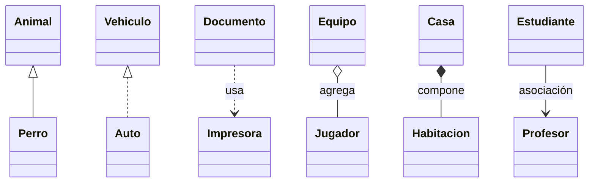

# RELACIONES ENTRE CLASES

en java existen 6 tipos de relaciones
una clase puede estar involucrada en una o mas relaciones con otras clases

|**TIPO DE RELACION**            |**PALABRA CLAVE**|**JAVA**                        |**NOTACION**        |
|--------------------------------|-----------------|--------------------------------|--------------------|
|ASOCIACION                      |Conoce a         |atributo                        |linea recta         |
|AGREGACION                      |Tiene un         | atributo compartido            |linea punta de rombo|
|COMPOSICION                     |Esta formado por |objeto creado dentro de la clase|lineaconrombonegrita|
|HERENCIA                        |Es un            |  extends                       |flecha en blanco    |
|IMPLEMENTACION(API)(REALIZACION)|Implementa       |implements                      |flecha entrecortada |
|DEPENDENCIA                     |   Usa           |parametro,varaible local,retorno|  -------------->   |

