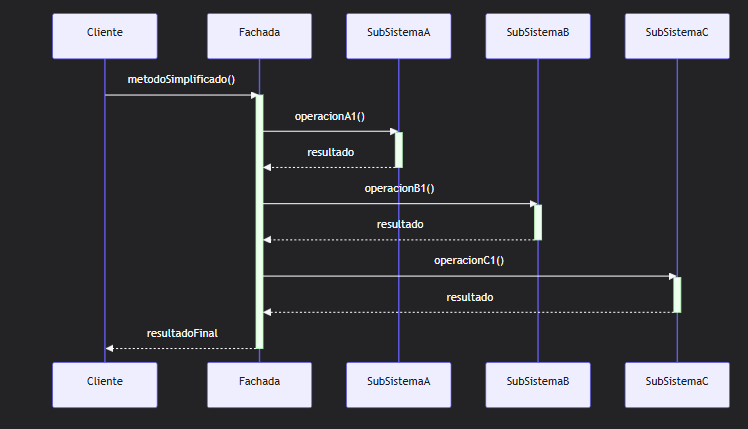

# QUE ES UNA FACHADA?

En diseño estructural de sofware
En palabras simples: Es una "puerta de entrada" simplificada a un sistema complejo. Su objetivo es ocultar la complejidad de un subsistema de clases, proporcionando al cliente una única interfaz (un solo método o clase) fácil de usar.

Es un intermediario que simplfica la vida en pocas palabras
Es una interfaz simple que oculta toda la complejidad
En un programa, a veces tienes muchas clases que hacen cosas complicadas. Si el usuario de tu programa tiene que usar todas esas clases directamente, se vuelve un desastre.

La Fachada es una clase nueva que:

- Agrupa las tareas complicadas.
- Te da un solo método fácil para usarlas.

