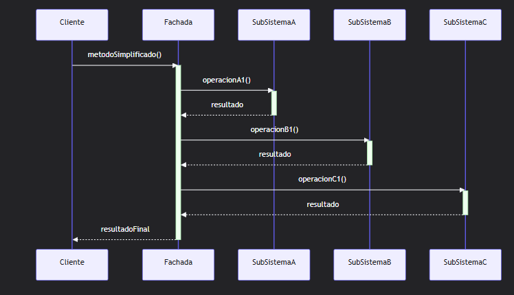

# QUE ES UNA FACHADA?

En diseño estructural de sofware
En palabras simples: Es una "puerta de entrada" simplificada a un sistema complejo. Su objetivo es ocultar la complejidad de un subsistema de clases, proporcionando al cliente una única interfaz (un solo método o clase) fácil de usar.

Es un intermediario que simplfica la vida en pocas palabras
Es una interfaz simple que oculta toda la complejidad
En un programa, a veces tienes muchas clases que hacen cosas complicadas. Si el usuario de tu programa tiene que usar todas esas clases directamente, se vuelve un desastre.

La Fachada es una clase nueva que:

- Agrupa las tareas complicadas.
- Te da un solo método fácil para usarlas.

## QUE ES 'THIS'

Es una variable de referencia implícita. Representa el objeto actual (la instancia actual) sobre el cual se está ejecutando un método o un constructor.
Existen 6 usos principales:
A. Diferenciar variables de instancia de variables locales (Sombreado de variables)
B. Llamar a otro constructor de la misma clase
C. Devolver la instancia actual de la clase
D. Pasar el objeto actual como parámetro a otro método
E. Pasar el objeto actual como argumento a un constructor
F. Acceder a métodos de la instancia (Opcional)

### Cuando usarlo??

1. Cuando hay conflicto de nombres: Si tus parámetros o variables locales se llaman igual que tus atributos de clase, debes usar this para asignar el valor correctamente.
2. Para reutilizar constructores: Cuando tienes múltiples constructores y quieres que uno llame a otro para no duplicar lógica de inicialización.
3. En el patrón Builder o fluent interfaces: Cuando quieres que tus métodos devuelvan el mismo objeto para permitir encadenamiento (objeto.setA(1).setB(2)), debes usar return this;.
4. Al registrar el objeto en listas externas o listeners: Cuando el objeto necesita inscribirse a sí mismo en un gestor de eventos (evento.addListener(this)).

**this** es la forma que tiene Java de decir "yo mismo" o "este objeto en particular". Úsalo cuando los nombres de las variables se confundan, cuando necesites llamar a otro constructor de tu misma clase, o cuando necesites pasar tu objeto actual a otra parte del programa.
